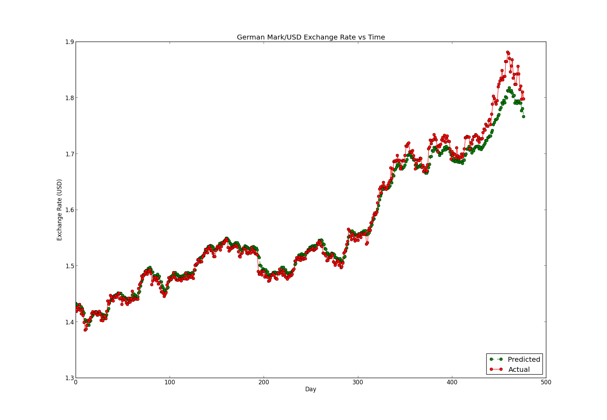

Science Research Project
========================

Repo for all science-research-related scripts

This contains the combined genetic algorithm and neural network script for my science research project.

So far, it has yielded good results. See below.

##Requirements

The script uses Pyevolve and PyBrain for the majority of its processing. It has been tested using PyBrain 0.3.1 and Pyevolve 0.6rc1. Pyevolve 0.6rc1 was chosen over 0.5 because it has multiprocessing support; this is the only feature of this version that it uses.